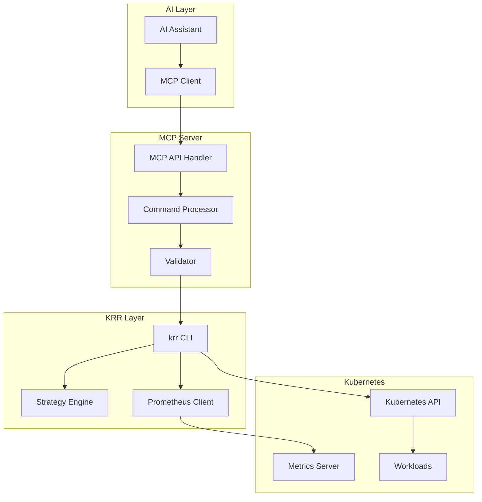

# Product Requirements Document: KRR MCP Server

**Version:** 1.0
**Date:** January 2025
**Status:** Draft
**Author:** MCP Integration Team

---

## Table of Contents

1. [Executive Summary](#executive-summary)
2. [Product Overview](#product-overview)
3. [Key Features and Capabilities](#key-features-and-capabilities)
4. [Technical Requirements](#technical-requirements)
5. [MCP Server Specifications](#mcp-server-specifications)
6. [Integration Architecture](#integration-architecture)
7. [Use Cases for AI Interaction](#use-cases-for-ai-interaction)
8. [Installation and Deployment](#installation-and-deployment)
9. [Command Interface Examples](#command-interface-examples)
10. [Success Metrics and Monitoring](#success-metrics-and-monitoring)
11. [Future Roadmap](#future-roadmap)
12. [Appendices](#appendices)

---

## 1. Executive Summary

The KRR MCP Server enables AI assistants to access and leverage the Kubernetes Resource Recommender (krr) CLI tool for automated resource optimization and cost management in Kubernetes environments. This integration empowers AI systems to analyze cluster resource usage, generate optimization recommendations, and assist with resource right-sizing decisions through conversational interfaces.

### Key Benefits:
- **Automated Resource Analysis**: AI can query real-time resource usage and generate recommendations
- **Cost Optimization**: Potential savings of up to 69% through intelligent resource right-sizing
- **Conversational DevOps**: Natural language interface for complex Kubernetes resource management
- **No Agent Required**: Leverages existing Prometheus infrastructure without cluster modifications

---

## 2. Product Overview

### What is KRR?

Kubernetes Resource Recommender (krr) is a Prometheus-based CLI tool developed by Robusta that provides intelligent resource recommendations for Kubernetes workloads. It analyzes historical metrics to suggest optimal CPU and memory requests/limits, helping teams reduce cloud costs while maintaining application performance.

### MCP Server Purpose

The KRR MCP Server acts as a bridge between AI assistants and the krr CLI tool, enabling:
- Natural language queries about resource usage
- Automated recommendation generation
- Intelligent resource optimization workflows
- Integration with existing DevOps practices

---

## 3. Key Features and Capabilities

### 3.1 Core Functionality

| Feature | Description |
|---------|-------------|
| **Prometheus Integration** | Seamless connection to Prometheus, Thanos, Victoria Metrics, and Mimir |
| **Resource Recommendations** | CPU requests (percentile-based) and memory limits (max + buffer) |
| **No Agent Architecture** | Operates without requiring cluster-side deployment |
| **Explainability Graphs** | Visual explanations of recommendation calculations |
| **Auto-Apply Mode** | Automatic implementation of approved recommendations |
| **Multi-Format Output** | JSON, YAML, CSV, HTML, and Markdown reports |
| **Extensible Strategies** | Custom Python-based recommendation algorithms |
| **Cloud Provider Support** | Native integration with Azure, GCP, and AWS managed Prometheus |

### 3.2 Reporting and Integration

- **Robusta SaaS Platform**: Enhanced visualization and historical tracking
- **Slack/Teams Notifications**: Automated alerts and recommendation summaries
- **Azure Blob Storage**: Report archival and sharing
- **k9s Plugin**: Terminal-based UI integration

### 3.3 Recommendation Algorithms

```python
# CPU Recommendation (Default Strategy)
cpu_request = percentile(cpu_usage, 99)

# Memory Recommendation (Default Strategy)
memory_request = max(memory_usage) * (1 + buffer_percentage)
```

---

## 4. Technical Requirements

### 4.1 Prerequisites

| Component | Minimum Version | Purpose |
|-----------|----------------|---------|
| Prometheus | 2.26+ | Metrics collection |
| kube-state-metrics | Latest stable | Kubernetes object metrics |
| cAdvisor | Latest stable | Container resource metrics |
| kubectl | Compatible with cluster | Cluster access |
| Python | 3.8+ | krr runtime |
| MCP Client | Latest | AI integration |

### 4.2 Environment Setup

- **Co-location Requirement**: krr must be installed on the same machine as the MCP client and kubectl
- **Network Access**: Direct connectivity to Prometheus endpoint
- **RBAC Permissions**: Read access to pods, deployments, and metrics
- **Storage**: Local storage for report generation and caching

### 4.3 Supported Environments

- **Local Development**: MacOS, Linux, Windows (WSL)
- **Container-based**: Docker images available
- **In-cluster Deployment**: Kubernetes Job or CronJob
- **CI/CD Integration**: GitHub Actions, GitLab CI, Jenkins

---

## 5. MCP Server Specifications

### 5.1 Available Commands

| Command | Description | Parameters |
|---------|-------------|------------|
| `analyze` | Generate resource recommendations | namespace, labels, format |
| `apply` | Apply recommendations to cluster | recommendations_file, dry_run |
| `history` | View historical recommendations | timerange, namespace |
| `export` | Export recommendations | format, destination |
| `validate` | Validate current resource settings | namespace, workload |
| `strategy` | List or apply custom strategies | strategy_name, parameters |

### 5.2 Input/Output Formats

**Input Schema:**
```json
{
  "command": "analyze",
  "parameters": {
    "namespace": "production",
    "labels": "app=web",
    "prometheus_url": "http://prometheus:9090",
    "history_duration": "7d",
    "format": "json"
  }
}
```

**Output Schema:**
```json
{
  "status": "success",
  "recommendations": [
    {
      "namespace": "production",
      "deployment": "web-app",
      "container": "nginx",
      "current": {
        "cpu_request": "100m",
        "memory_request": "128Mi"
      },
      "recommended": {
        "cpu_request": "250m",
        "memory_request": "256Mi"
      },
      "savings": {
        "percentage": 45,
        "monthly_cost": "\$125"
      }
    }
  ],
  "metadata": {
    "timestamp": "2025-01-15T10:30:00Z",
    "cluster": "prod-cluster-1",
    "strategy": "default"
  }
}
```

### 5.3 Authentication and Security

- **Kubernetes Auth**: Leverages existing kubeconfig credentials
- **Prometheus Auth**: Support for basic auth, bearer tokens, and TLS
- **MCP Security**: End-to-end encryption for AI-to-krr communication
- **Audit Logging**: All operations logged with user context

### 5.4 Error Handling

| Error Code | Description | Remediation |
|------------|-------------|-------------|
| KRR001 | Prometheus connection failed | Verify endpoint and credentials |
| KRR002 | Insufficient metrics data | Increase history duration |
| KRR003 | RBAC permission denied | Update cluster role bindings |
| KRR004 | Invalid strategy specified | Check available strategies |
| KRR005 | Output format not supported | Use supported format |

---

## 6. Integration Architecture

### 6.1 System Architecture



### 6.2 Data Flow

1. **Request Phase**: AI generates natural language request → MCP client converts to structured command
2. **Processing Phase**: MCP server validates and executes krr command
3. **Analysis Phase**: krr queries Prometheus and calculates recommendations
4. **Response Phase**: Results formatted and returned to AI for interpretation

---

## 7. Use Cases for AI Interaction

### 7.1 Cost Optimization Analysis

**User**: "What are the potential cost savings in the production namespace?"

**AI Assistant Actions**:
1. Execute `krr analyze --namespace production`
2. Parse recommendations
3. Calculate total savings
4. Present summary with top optimization opportunities

### 7.2 Resource Right-Sizing

**User**: "My web application is experiencing performance issues. Can you check if it needs more resources?"

**AI Assistant Actions**:
1. Identify application workloads
2. Run `krr analyze` with specific labels
3. Compare current vs recommended resources
4. Suggest performance-oriented adjustments

### 7.3 Automated Optimization Workflow

**User**: "Apply resource optimizations to all development environments"

**AI Assistant Actions**:
1. Generate recommendations for dev namespaces
2. Create review summary
3. Apply changes with `krr apply --dry-run`
4. Execute actual changes upon confirmation

### 7.4 Compliance and Reporting

**User**: "Generate a monthly resource optimization report for the finance team"

**AI Assistant Actions**:
1. Collect recommendations across all namespaces
2. Export in CSV format
3. Calculate cumulative savings
4. Format executive summary

---

## 8. Installation and Deployment

### 8.1 Local Installation

```bash
# Install krr via Homebrew (macOS/Linux)
brew tap robusta-dev/homebrew-krr
brew install krr

# Install MCP server
git clone https://github.com/your-org/krr-mcp-server
cd krr-mcp-server
pip install -r requirements.txt

# Configure MCP client
export MCP_SERVER_URL="http://localhost:8080"
export KUBECONFIG="~/.kube/config"
```

### 8.2 Docker Deployment

```dockerfile
FROM python:3.9-slim

# Install dependencies
RUN apt-get update && apt-get install -y curl git
RUN pip install robusta-krr mcp-server

# Copy configuration
COPY config.yaml /app/config.yaml
COPY mcp_server.py /app/mcp_server.py

# Set environment
ENV PROMETHEUS_URL="http://prometheus:9090"
ENV MCP_PORT="8080"

# Run MCP server
CMD ["python", "/app/mcp_server.py"]
```

### 8.3 Kubernetes Deployment

```yaml
apiVersion: apps/v1
kind: Deployment
metadata:
  name: krr-mcp-server
  namespace: mcp-system
spec:
  replicas: 1
  selector:
    matchLabels:
      app: krr-mcp-server
  template:
    metadata:
      labels:
        app: krr-mcp-server
    spec:
      serviceAccount: krr-mcp-sa
      containers:
      - name: mcp-server
        image: your-registry/krr-mcp-server:latest
        ports:
        - containerPort: 8080
        env:
        - name: PROMETHEUS_URL
          value: "http://prometheus.monitoring:9090"
        - name: LOG_LEVEL
          value: "INFO"
        resources:
          requests:
            cpu: 100m
            memory: 256Mi
          limits:
            cpu: 500m
            memory: 512Mi
---
apiVersion: v1
kind: Service
metadata:
  name: krr-mcp-server
  namespace: mcp-system
spec:
  selector:
    app: krr-mcp-server
  ports:
  - port: 8080
    targetPort: 8080
```

---

## 9. Command Interface Examples

### 9.1 Basic Analysis

```bash
# Analyze all namespaces
krr analyze --prometheus-url http://prometheus:9090

# Analyze specific namespace with custom strategy
krr analyze \
  --namespace production \
  --strategy conservative \
  --history-duration 14d
```

### 9.2 Filtered Analysis

```bash
# Analyze by labels
krr analyze \
  --selector "app=frontend,env=prod" \
  --format json \
  --output recommendations.json

# Exclude specific workloads
krr analyze \
  --namespace default \
  --exclude-deployments "test-*,debug-*"
```

### 9.3 Auto-Apply Mode

```bash
# Dry run first
krr apply \
  --recommendations recommendations.json \
  --dry-run

# Apply with confirmation
krr apply \
  --recommendations recommendations.json \
  --confirm
```

### 9.4 Reporting Commands

```bash
# Generate HTML report
krr report \
  --format html \
  --output cost-analysis.html \
  --include-graphs

# Export to Robusta SaaS
krr export \
  --destination robusta \
  --api-key $ROBUSTA_API_KEY
```

---

## 10. Success Metrics and Monitoring

### 10.1 Key Performance Indicators

| Metric | Target | Measurement |
|--------|--------|-------------|
| Resource Cost Reduction | >30% | Monthly cloud bill analysis |
| Recommendation Accuracy | >95% | Post-implementation validation |
| API Response Time | <2s | 95th percentile latency |
| System Availability | 99.9% | Uptime monitoring |
| User Adoption Rate | >80% | Active users per month |

### 10.2 Monitoring Implementation

```yaml
# Prometheus metrics
krr_recommendations_total{namespace, status}
krr_cost_savings_dollars{namespace, timerange}
krr_api_request_duration_seconds{endpoint, method}
krr_errors_total{error_type}
```

### 10.3 Alerting Rules

```yaml
groups:
- name: krr-mcp-alerts
  rules:
  - alert: KRRAPIHighLatency
    expr: krr_api_request_duration_seconds{quantile="0.95"} > 2
    for: 5m
    annotations:
      summary: "KRR API latency is high"

  - alert: KRRRecommendationFailures
    expr: rate(krr_errors_total[5m]) > 0.1
    for: 10m
    annotations:
      summary: "High rate of recommendation failures"
```

---

## 11. Future Roadmap

### 11.1 Q2 2025
- **GPU Resource Support**: Recommendations for GPU-enabled workloads
- **Custom Metrics Integration**: Support for application-specific metrics
- **Multi-Cluster Management**: Centralized recommendations across clusters

### 11.2 Q3 2025
- **Predictive Scaling**: ML-based prediction of resource needs
- **Cost Anomaly Detection**: Automatic alerting on unusual resource consumption
- **GitOps Integration**: Automated PR generation for resource changes

### 11.3 Q4 2025
- **Autoscaling Integration**: Direct HPA/VPA configuration management
- **FinOps Dashboard**: Comprehensive cost management interface
- **Compliance Policies**: Enforce resource governance rules

### 11.4 Long-term Vision
- **AI-Driven Optimization**: Self-learning recommendation engine
- **Cross-Cloud Optimization**: Unified management across providers
- **Carbon Footprint Tracking**: Environmental impact metrics

---

## 12. Appendices

### Appendix A: Glossary

| Term | Definition |
|------|------------|
| **MCP** | Model Context Protocol - AI integration standard |
| **krr** | Kubernetes Resource Recommender |
| **HPA** | Horizontal Pod Autoscaler |
| **VPA** | Vertical Pod Autoscaler |
| **RBAC** | Role-Based Access Control |
| **FinOps** | Financial Operations for cloud cost management |

### Appendix B: References

1. [Robusta KRR GitHub Repository](https://github.com/robusta-dev/krr)
2. [Prometheus Documentation](https://prometheus.io/docs/)
3. [Kubernetes Resource Management](https://kubernetes.io/docs/concepts/configuration/manage-resources-containers/)
4. [MCP Protocol Specification](https://mcp.dev/docs)

### Appendix C: Configuration Examples

**MCP Server Configuration (config.yaml):**
```yaml
server:
  port: 8080
  host: 0.0.0.0

krr:
  prometheus_url: "${PROMETHEUS_URL}"
  default_history: "7d"
  default_strategy: "default"

auth:
  enabled: true
  type: "bearer"

logging:
  level: "INFO"
  format: "json"
```

**Custom Strategy Example:**
```python
class ConservativeStrategy(BaseStrategy):
    def calculate_cpu_request(self, metrics):
        # Use 95th percentile instead of 99th
        return percentile(metrics['cpu'], 95)

    def calculate_memory_request(self, metrics):
        # Add 30% buffer instead of 20%
        return max(metrics['memory']) * 1.3
```

---

**Document Version History:**
- v1.0 (January 2025): Initial release

**Approval:**
- Product Manager: _________________
- Technical Lead: _________________
- Security Review: _________________
