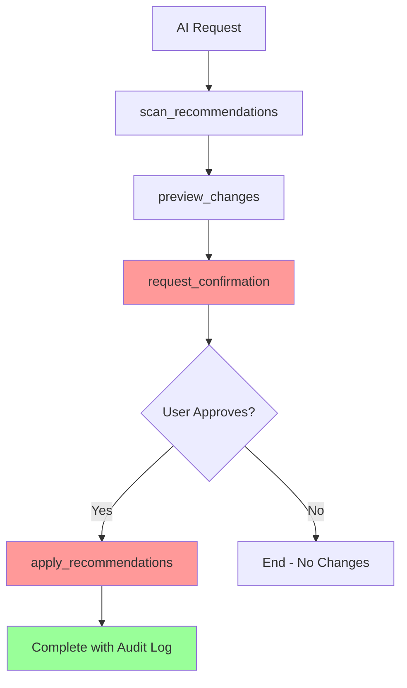

# krr MCP Server API Documentation

Complete API reference for the krr MCP Server, a safety-first MCP implementation for AI-assisted Kubernetes resource optimization.

## 📚 Documentation Index

### 🔧 API Reference
**[api-reference.md](./api-reference.md)** - Complete API documentation for all 9 MCP tools

### 🛡️ Safety Guide  
**[safety-guide.md](./safety-guide.md)** - Understanding safety features and risk assessment

### 💡 Usage Examples
**[usage-examples.md](./usage-examples.md)** - Practical examples and workflow demonstrations

### 📋 Machine-Readable Formats
- **[api-documentation.json](./api-documentation.json)** - Complete API specification in JSON format
- **[openapi.json](./openapi.json)** - OpenAPI 3.0 specification for integration

## 🧰 Available MCP Tools

| Tool | Purpose | Safety Level | Documentation |
|------|---------|--------------|---------------|
| `scan_recommendations` | Get krr optimization recommendations | Read-only | [View →](./api-reference.md#scan_recommendations) |
| `preview_changes` | Show what would change | Analysis only | [View →](./api-reference.md#preview_changes) |
| `request_confirmation` | Get user approval for changes | **Confirmation required** | [View →](./api-reference.md#request_confirmation) |
| `apply_recommendations` | Execute approved changes | **Requires valid token** | [View →](./api-reference.md#apply_recommendations) |
| `rollback_changes` | Revert to previous state | **Requires confirmation** | [View →](./api-reference.md#rollback_changes) |
| `get_safety_report` | Analyze change risks | Analysis only | [View →](./api-reference.md#get_safety_report) |
| `get_execution_history` | View audit trail | Read-only | [View →](./api-reference.md#get_execution_history) |
| `generate_documentation` | Generate API docs | Read-only | [View →](./api-reference.md#generate_documentation) |
| `get_tool_versions` | Check tool versions | Read-only | [View →](./api-reference.md#get_tool_versions) |

## 🚨 Critical Safety Notice

**NO CLUSTER MODIFICATIONS WITHOUT EXPLICIT USER CONFIRMATION**

This API is designed with safety as the top priority:

- ✅ **Read-only operations** can be called freely
- ⚠️ **Analysis operations** preview changes but don't apply them
- 🚫 **Modification operations** require user confirmation tokens
- 🔒 **All confirmations expire after 5 minutes**
- 📝 **Complete audit trail** for all operations

## 📖 Quick Start

### 1. Basic Workflow



### 2. Safety-First Example

```python
# 1. Get recommendations (safe - read-only)
recommendations = await scan_recommendations({
    "namespace": "production",
    "strategy": "simple"
})

# 2. Preview what would change (safe - analysis only)
preview = await preview_changes({
    "recommendations": recommendations["recommendations"]
})

# 3. Request user confirmation (safety checkpoint)
confirmation = await request_confirmation({
    "changes": preview["preview"],
    "risk_level": "medium"
})

# 4. User must explicitly approve
# This step happens outside the API - user reviews and approves

# 5. Apply changes with valid token (cluster modification)
result = await apply_recommendations({
    "confirmation_token": confirmation["confirmation_token"]
})
```

## 🔗 Integration Examples

### Claude Desktop Configuration

Add to your `claude_desktop_config.json`:

```json
{
  "mcpServers": {
    "krr-mcp": {
      "command": "uv",
      "args": ["run", "python", "/path/to/krr-mcp/main.py"],
      "env": {
        "KUBECONFIG": "/path/to/your/kubeconfig",
        "PROMETHEUS_URL": "http://prometheus.monitoring.svc.cluster.local:9090"
      }
    }
  }
}
```

### AI Assistant Usage

Natural language queries that work:

- *"Analyze resource usage in my production namespace"*
- *"Show me potential CPU and memory optimizations"*
- *"What would happen if I apply these recommendations?"*
- *"I want to optimize the web-app deployment - show me the changes first"*

## 🛠️ Development Integration

### Using the JSON API

The `api-documentation.json` file provides complete API metadata for programmatic integration:

```python
import json

# Load API specification
with open('api-documentation.json') as f:
    api_spec = json.load(f)

# Get tool information
tools = api_spec['tools']
for tool_name, tool_info in tools.items():
    print(f"Tool: {tool_name}")
    print(f"Description: {tool_info['description']}")
    print(f"Safety Level: {tool_info['safety_level']}")
```

### Using the OpenAPI Specification

The `openapi.json` file can be used with OpenAPI tools:

- **Code Generation**: Generate client libraries with swagger-codegen
- **API Testing**: Use with Postman, Insomnia, or curl
- **Documentation**: Generate interactive docs with Swagger UI

## 📊 Error Handling

All API tools return standardized error responses:

```json
{
  "status": "error",
  "error_code": "INVALID_TOKEN",
  "error_message": "Confirmation token has expired",
  "details": {
    "token_expired_at": "2025-01-29T16:35:00Z",
    "current_time": "2025-01-29T16:40:00Z"
  }
}
```

Common error codes:
- `COMPONENT_UNAVAILABLE`: krr or kubectl not available
- `INVALID_TOKEN`: Confirmation token invalid/expired
- `VALIDATION_ERROR`: Invalid input parameters
- `KUBERNETES_ERROR`: Cluster operation failed
- `SAFETY_VIOLATION`: Change blocked by safety rules

## 🔄 Versioning

All tools support versioning. Check current versions:

```python
versions = await get_tool_versions()
print(f"API Version: {versions['api_version']}")
```

## 📝 Audit Trail

Every operation is logged for compliance:

```python
# Get execution history
history = await get_execution_history({
    "start_date": "2025-01-29",
    "end_date": "2025-01-30"
})

# Review audit logs
for entry in history["entries"]:
    print(f"{entry['timestamp']}: {entry['action']} by {entry['user']}")
```

---

## 🆘 Support

- **Issues**: Report API bugs on [GitHub Issues](https://github.com/your-org/krr-mcp/issues)
- **Questions**: Check [troubleshooting guide](../troubleshooting.md)
- **Security**: Email security@yourorg.com for security vulnerabilities

---

**Remember: This API can modify production Kubernetes clusters. Always review changes carefully and test in non-production environments first.** 