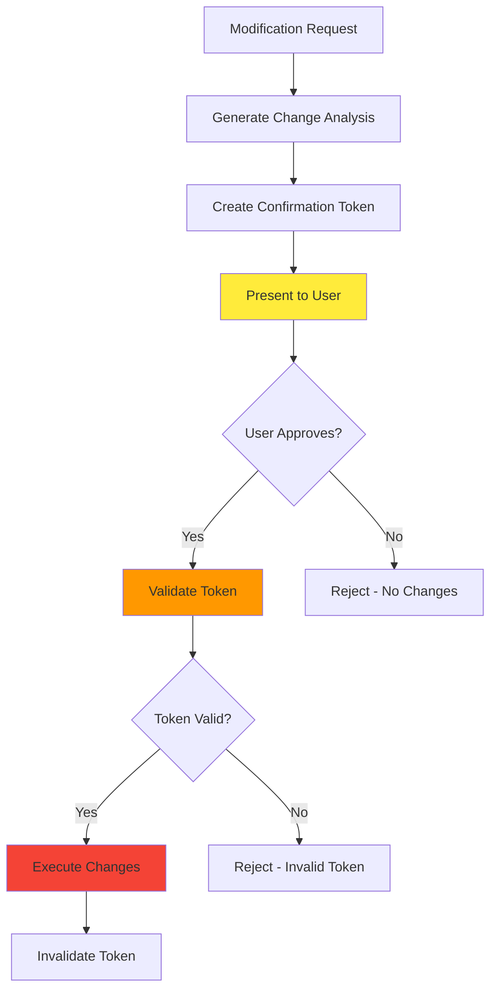

# Safety Guide

Complete guide to the safety features and risk management capabilities of the KRR MCP Server.

## 🚨 Core Safety Principle

**NO CLUSTER MODIFICATIONS WITHOUT EXPLICIT USER CONFIRMATION**

Every aspect of the KRR MCP Server is designed around this fundamental principle. This guide explains how these safety mechanisms work and how to use them effectively.

## 🛡️ Safety Architecture

### Multi-Layer Protection

The KRR MCP Server implements defense-in-depth with multiple safety layers:

```
┌─────────────────────────────────────────────────────────────┐
│                    AI Assistant Layer                       │
│                   (Natural Language)                        │
└─────────────────────┬───────────────────────────────────────┘
                      │
┌─────────────────────▼───────────────────────────────────────┐
│                   MCP Tools Layer                           │
│              (Read/Analysis/Modification)                   │
└─────────────────────┬───────────────────────────────────────┘
                      │
┌─────────────────────▼───────────────────────────────────────┐
│                   Safety Module                             │
│             (Validation & Confirmation)                     │
└─────────────────────┬───────────────────────────────────────┘
                      │
┌─────────────────────▼───────────────────────────────────────┐
│                  Execution Layer                            │
│            (kubectl with Transaction Support)               │
└─────────────────────┬───────────────────────────────────────┘
                      │
┌─────────────────────▼───────────────────────────────────────┐
│                 Kubernetes Cluster                          │
│                   (Your Resources)                          │
└─────────────────────────────────────────────────────────────┘
```

Each layer provides independent safety controls that must all pass for any cluster modification.

## 🔐 Safety Features Overview

### 1. Confirmation Requirements

#### Token-Based Security
- **Unique Tokens**: Each confirmation generates a cryptographically secure token
- **Single Use**: Tokens are invalidated after one use to prevent replay attacks
- **Time Expiration**: Tokens expire after 5 minutes to prevent stale approvals
- **Context Binding**: Tokens are bound to specific changes and cannot be reused

#### Confirmation Process


### 2. Risk Assessment Engine

#### Risk Factors Analyzed

**Resource Impact**:
- CPU change percentage (>500% = high risk)
- Memory change percentage (>500% = high risk)
- Number of pods affected
- Rolling restart requirements

**Workload Criticality**:
- Production namespace detection
- Critical workload pattern matching
- Database and controller identification
- Stateful vs stateless workload analysis

**Change Characteristics**:
- Increase vs decrease operations
- Single vs batch operations
- Historical stability of workloads
- Recent change frequency

#### Risk Levels

**🟢 LOW RISK**
- Minor resource adjustments (<50% change)
- Non-production environments
- Non-critical workloads
- Historical stability evidence

**🟡 MEDIUM RISK**
- Moderate resource adjustments (50-200% change)
- Production environments with safeguards
- Some impact on application performance
- Standard monitoring requirements

**🔴 HIGH RISK**
- Large resource adjustments (200-500% change)
- Production critical workloads
- Potential for service disruption
- Enhanced monitoring required

**⚫ CRITICAL RISK**
- Extreme resource adjustments (>500% change)
- Database or controller modifications
- Changes blocked by safety rules
- Manual override required

### 3. Production Protection

#### Namespace-Based Protections

**Production Namespace Detection**:
```bash
# Default patterns (configurable)
PRODUCTION_NAMESPACE_PATTERNS=prod,production,live,main
```

When production namespaces are detected:
- ⚠️ Enhanced safety warnings displayed
- 🔍 Additional validation steps required
- ⏱️ Extended confirmation timeouts available
- 📋 Detailed impact analysis mandated
- 🚨 Rollback preparation prioritized

#### Critical Workload Protection

**Critical Workload Patterns**:
```bash
# Default patterns (configurable)
CRITICAL_WORKLOAD_PATTERNS=postgres,mysql,redis,controller,operator,etcd
```

Critical workloads receive:
- 🛑 **Extra confirmation steps**
- 📊 **Enhanced impact analysis**
- ⚡ **Priority rollback preparation**
- 🔍 **Post-change monitoring requirements**
- 📋 **Mandatory change documentation**

### 4. Rollback Capabilities

#### Automatic Snapshot Creation

Before any cluster modification:
1. **Capture Current State**: Complete resource manifests saved
2. **Generate Rollback Commands**: kubectl commands prepared
3. **Store Metadata**: Timestamps, user context, change details
4. **Set Expiration**: 7-day retention with cleanup automation

#### Rollback Process

```yaml
# Example rollback snapshot
rollback_snapshot:
  id: "web-app-20250129-143052"
  timestamp: "2025-01-29T14:30:52Z"
  user: "user@company.com"
  resources:
    - apiVersion: apps/v1
      kind: Deployment
      metadata:
        name: web-app
        namespace: production
      spec:
        # Original resource specification
  rollback_commands:
    - "kubectl patch deployment web-app -n production --patch '...'"
  retention_until: "2025-02-05T14:30:52Z"
```

### 5. Audit Trail System

#### Complete Operation Logging

Every operation generates comprehensive audit logs:

```json
{
  "timestamp": "2025-01-29T14:30:52Z",
  "event_id": "evt_20250129_143052_001",
  "user": "user@company.com",
  "operation": "apply_recommendations",
  "tool_used": "apply_recommendations",
  "resource_changes": [
    {
      "resource": "deployment/web-app",
      "namespace": "production",
      "changes": {
        "cpu_request": {"from": "100m", "to": "50m"},
        "memory_request": {"from": "128Mi", "to": "256Mi"}
      }
    }
  ],
  "safety_assessment": {
    "risk_level": "medium",
    "safety_warnings": ["production_namespace"],
    "confirmation_required": true
  },
  "confirmation": {
    "token": "conf_abc123...",
    "confirmed_at": "2025-01-29T14:35:15Z",
    "user_response": "yes"
  },
  "execution": {
    "status": "success",
    "duration": "135s",
    "pods_restarted": 3,
    "rollback_snapshot": "web-app-20250129-143052"
  }
}
```

#### Audit Trail Features

- **Immutable Logging**: Logs cannot be modified after creation
- **Searchable History**: Query by date, user, resource, or operation
- **Compliance Ready**: Structured format for audit requirements
- **Export Capabilities**: JSON, CSV, and formatted reports available

## ⚙️ Safety Configuration

### Environment Variables

```bash
# Safety Limits
MAX_RESOURCE_CHANGE_PERCENT=500    # Block changes over 500%
CONFIRMATION_TIMEOUT_SECONDS=300   # 5-minute token expiration
ROLLBACK_RETENTION_DAYS=7          # Keep rollback data for 7 days

# Production Protection
PRODUCTION_NAMESPACE_PATTERNS=prod,production,live,main
CRITICAL_WORKLOAD_PATTERNS=postgres,mysql,redis,controller,operator

# Safety Overrides (use with extreme caution)
ALLOW_EXTREME_CHANGES=false        # Override 500% limit
SKIP_PRODUCTION_WARNINGS=false     # Disable production warnings
EXTEND_CONFIRMATION_TIMEOUT=false  # Allow longer token validity
```

### Advanced Safety Configuration

```yaml
# config.yaml
safety:
  resource_limits:
    max_cpu_change_percent: 500
    max_memory_change_percent: 500
    max_pods_affected: 100
    
  production_protection:
    namespace_patterns:
      - prod
      - production
      - live
    enhanced_warnings: true
    extended_confirmation: true
    
  critical_workloads:
    patterns:
      - postgres
      - mysql
      - redis
      - controller
      - operator
    require_manual_approval: true
    mandatory_rollback_testing: true
    
  audit:
    log_level: "detailed"
    retention_days: 90
    export_formats: ["json", "csv"]
    compliance_mode: true
```

## 🚫 Safety Violations and Blocks

### Automatic Blocking Scenarios

The system automatically blocks operations that violate safety rules:

#### Resource Limit Violations
```
SAFETY VIOLATION: Resource change exceeds maximum allowed limit

Deployment: database-server (namespace: production)
- Memory Request: 1Gi → 8Gi (+700%)
- Maximum allowed change: 500%

Action: BLOCKED
Reason: Extreme resource change detected
Override: Contact administrator for manual approval
```

#### Critical Workload Protection
```
SAFETY VIOLATION: Critical workload modification detected

StatefulSet: postgres-cluster (namespace: production)
- Pattern matched: "postgres" (critical workload)
- Risk level: CRITICAL

Action: BLOCKED
Reason: Critical workload requires special approval process
Next steps: Use manual kubectl operations with extra care
```

#### Production Safety Enforcement
```
SAFETY WARNING: Production environment modification

Namespace: production (production pattern matched)
Deployments affected: 5
Pods to restart: 15

Enhanced safety measures active:
- Extended confirmation timeout: 10 minutes
- Mandatory rollback preparation
- Post-change monitoring required
- Detailed change documentation saved
```

## 🛠️ Safety Best Practices

### Operational Guidelines

#### For Development Teams

**DO:**
- ✅ Always start with non-production clusters
- ✅ Read and understand all confirmation prompts
- ✅ Test optimizations with single deployments first
- ✅ Monitor applications for 24-48 hours after changes
- ✅ Keep rollback commands readily available
- ✅ Document the business justification for changes

**DON'T:**
- 🚫 Rush through confirmation prompts
- 🚫 Apply bulk changes without understanding impact
- 🚫 Optimize during peak traffic hours
- 🚫 Ignore safety warnings or risk assessments
- 🚫 Skip post-change monitoring
- 🚫 Apply changes without stakeholder awareness

#### For Platform Teams

**Setup Guidelines:**
- 🔧 Configure appropriate safety limits for your environment
- 🔧 Set up monitoring and alerting for resource changes
- 🔧 Define clear escalation procedures for safety violations
- 🔧 Implement regular audit log reviews
- 🔧 Create rollback testing procedures
- 🔧 Establish change management integration

**Monitoring Requirements:**
- 📊 Track resource utilization after optimizations
- 📊 Monitor application performance metrics
- 📊 Watch for OOM kills or CPU throttling
- 📊 Review cost impact in cloud billing
- 📊 Audit safety violation attempts
- 📊 Measure rollback success rates

### Risk Mitigation Strategies

#### Graduated Deployment Approach

**Phase 1: Development**
```bash
# Relaxed safety settings for dev environment
DEVELOPMENT_MODE=true
MAX_RESOURCE_CHANGE_PERCENT=1000
CONFIRMATION_TIMEOUT_SECONDS=600
```

**Phase 2: Staging**
```bash
# Standard safety settings
DEVELOPMENT_MODE=false
MAX_RESOURCE_CHANGE_PERCENT=500
CONFIRMATION_TIMEOUT_SECONDS=300
```

**Phase 3: Production**
```bash
# Enhanced safety settings
PRODUCTION_MODE=true
MAX_RESOURCE_CHANGE_PERCENT=200
CONFIRMATION_TIMEOUT_SECONDS=300
CRITICAL_WORKLOAD_PROTECTION=strict
```

#### Change Management Integration

**Pre-Change Checklist:**
- [ ] Impact analysis reviewed and approved
- [ ] Rollback plan prepared and tested
- [ ] Monitoring systems ready
- [ ] Stakeholders notified
- [ ] Change window scheduled
- [ ] Emergency contacts available

**Post-Change Checklist:**
- [ ] Application health verified
- [ ] Performance metrics stable
- [ ] No error rate increases
- [ ] Resource utilization optimal
- [ ] Rollback capability confirmed
- [ ] Change documentation updated

## 🆘 Emergency Procedures

### When Safety Systems Alert

#### Safety Violation Detected
1. **Stop immediately** - Don't attempt to override
2. **Review the violation** - Understand what triggered it
3. **Assess the risk** - Is the change actually dangerous?
4. **Choose appropriate action**:
   - Modify approach to comply with safety rules
   - Use manual kubectl for exceptional cases
   - Contact administrator for safety limit adjustments

#### Unexpected Behavior After Changes
1. **Don't panic** - Rollback capabilities are always available
2. **Assess impact** - Check application health immediately
3. **Use rollback** - "Emergency rollback: revert latest changes"
4. **Verify restoration** - Confirm applications are healthy
5. **Investigate** - Determine root cause
6. **Document** - Record incident for future prevention

#### System Overrides (Extreme Caution)

```bash
# EMERGENCY ONLY - Temporarily override safety limits
export EMERGENCY_OVERRIDE=true
export ALLOW_EXTREME_CHANGES=true
export MAX_RESOURCE_CHANGE_PERCENT=2000

# IMPORTANT: Reset after emergency
unset EMERGENCY_OVERRIDE
unset ALLOW_EXTREME_CHANGES
export MAX_RESOURCE_CHANGE_PERCENT=500
```

**Override Usage Guidelines:**
- 🚨 Only for genuine emergencies
- 📋 Document business justification
- 👥 Get approval from multiple stakeholders
- ⏱️ Limit override duration
- 📊 Enhanced monitoring during override period
- 🔄 Reset safety limits immediately after

## 📊 Safety Metrics and Monitoring

### Key Safety Metrics

**Safety Compliance:**
- Confirmation rate: 100% (no bypasses allowed)
- Safety violation blocks: Track frequency and reasons
- Rollback success rate: >99% target
- Audit log completeness: 100% coverage

**Risk Assessment Accuracy:**
- High-risk changes: Monitor for actual issues
- Production impact: Track service disruptions
- False positive rate: Minimize unnecessary blocks
- User satisfaction: Safety vs usability balance

**System Health:**
- Token expiration rate: Should be low
- Confirmation timeout rate: Monitor user experience
- Rollback usage: Track frequency and success
- Audit log integrity: Verify completeness

### Monitoring Setup

```yaml
# Prometheus alerts for safety monitoring
groups:
  - name: krr-mcp-safety
    rules:
      - alert: SafetyViolationBlocked
        expr: krr_mcp_safety_violations_total > 0
        labels:
          severity: warning
        annotations:
          summary: "Safety violation blocked in KRR MCP Server"
          
      - alert: HighRollbackRate
        expr: rate(krr_mcp_rollbacks_total[1h]) > 0.1
        labels:
          severity: critical
        annotations:
          summary: "High rollback rate detected"
          
      - alert: AuditLogGap
        expr: krr_mcp_audit_log_gaps > 0
        labels:
          severity: critical
        annotations:
          summary: "Audit log integrity issue detected"
```

## 🔗 Integration with Security Tools

### SIEM Integration

Export audit logs to security information and event management systems:

```bash
# Export audit logs for SIEM
uv run python scripts/export_audit_logs.py \
  --format siem \
  --start-date 2025-01-01 \
  --end-date 2025-01-31 \
  --output /path/to/siem/import/
```

### Compliance Reporting

```bash
# Generate compliance reports
uv run python scripts/compliance_report.py \
  --period monthly \
  --standards "SOC2,PCI-DSS" \
  --output compliance-2025-01.pdf
```

## 📚 Related Documentation

- **[Installation Guide](installation.md)** - Setting up safety configurations
- **[User Guide](user-guide.md)** - Safe usage patterns and best practices
- **[API Reference](api/README.md)** - Technical details of safety implementations
- **[Troubleshooting](troubleshooting.md)** - Resolving safety-related issues

---

**Remember**: The safety features of KRR MCP Server are designed to prevent accidents, not to obstruct legitimate operations. Understanding and working with these systems will help you optimize your clusters safely and confidently. 